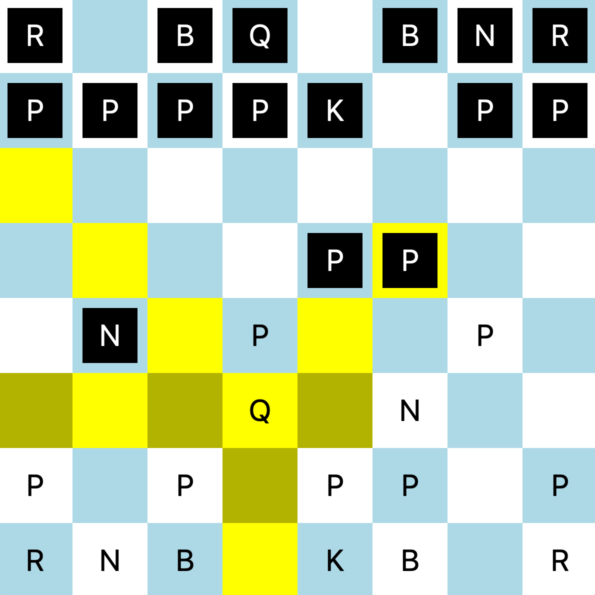

# ChessProj
<!-- Add Screenshots -->
|  |  |  |
| :-------------------------------------------------: | :---------------------------------------------------: | :--------------------------------------------------: |
|                 starting game state                 |                  game in progress 1                   |                  game in progress 2                  |
## About
A chess program made using JavaFX 14.
Created by Nnamdi Obi and Terrence Hampton for NCSSM's CS4060 "Java with Topics" course.

## Getting Started

Compile this project by using a java compiler that compiles with javafx packages on the [`BoardDisplay.java`](BoardDisplay.java) file. 

To make it easier, you can update the [`compile.sh`](compile.sh) script with your system's path to the JavaFX SDK and then run it.

## How it works

The Piece.java file is an abstract class that defines the framework of the different chess pieces.
The [`Board.java`](Board.java) file incorporates different chess pieces into a board, and is the backbone for the BoardDisplay.java file.
The [`BoardDisplay.java`](BoardDisplay.java) file defines the UI through which the uses interacts with the board.

Press `i` when running the application to bring up a debug menu, which includes a list of moves in the game so far, and also a list of variables for each side.

